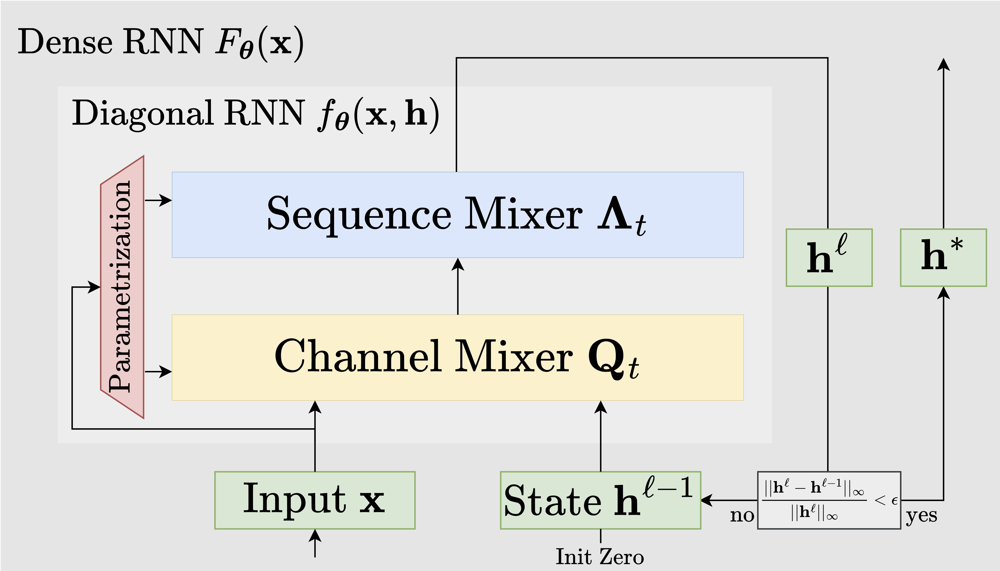

# FP-RNN

This code accompanies the paper:\
\[[NeurIPS'2025](https://neurips.cc/)\] \[[Fixed-Point RNNs: Interpolating from Diagonal to Dense](https://arxiv.org/abs/2503.10799)\]\
Sajad Movahedi, Felix Sarnthein, Nicola Muca Cirone, Antonio Orvieto

Linear recurrent neural networks (RNNs) and state-space models (SSMs) such as Mamba have become promising alternatives to softmax-attention as sequence mixing layers in Transformer architectures. Current models, however, do not exhibit the full state-tracking expressivity of RNNs because they rely on channel-wise (i.e. diagonal) sequence mixing. 
In this paper, we investigate parameterizations of a large class of dense linear RNNs as fixed-points of parallelizable diagonal linear RNNs.
The resulting models can naturally trade expressivity for efficiency at a fixed number of parameters
and achieve state-of-the-art results on the state-tracking benchmarks $A_5$ and $S_5$, while matching performance on copying and other tasks.



---

## Setup

Use pip with the provided requirements:
```bash
python -m venv .venv && source .venv/bin/activate
# CPU
pip install -r requirements.txt
# GPU (specify the torch CUDA index)
pip install --extra-index-url https://download.pytorch.org/whl/cu121 -r requirements.txt
# Optional CUDA conv kernels
pip install causal-conv1d
```

---

## Running

- Copying: `bash run_copy_exp.sh`
- Word problems: `bash run_word_problem_exp.sh`
- Arithmetic: `bash run_arithmetic_exp.sh`
- Language Modeling: `cd plainLM && python train.py --config=./config/fpmamba.yaml`

Adjust script flags and config files as needed (see the paper for details).

---

## Credits

- Language modeling pipeline adapted from https://github.com/Niccolo-Ajroldi/plainLM  
- Arithmetic tasks adapted from https://github.com/automl/DeltaProduct  
- Word problem tasks adapted from https://github.com/jopetty/word-problem  
- Copy task adapted from https://github.com/sjelassi/transformers_ssm_copy  

---

## Citation

If you find this code useful, please cite:

```bibtex
@inproceedings{
    movahedi2025fixedpoint,
    title={Fixed-Point {RNN}s: Interpolating from Diagonal to Dense},
    author={Sajad Movahedi and Felix Sarnthein and Nicola Muca Cirone and Antonio Orvieto},
    booktitle={The Thirty-ninth Annual Conference on Neural Information Processing Systems},
    year={2025},
    url={https://openreview.net/forum?id=KT8y9pFgJE}
}
```
